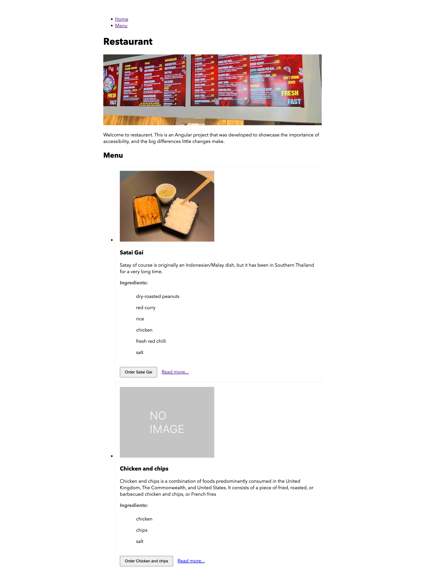

# restaurantmenu.io
[View in browser](https://restaurantmenu-io.stackblitz.io/)

# Playground
[Edit on stackblitz](https://stackblitz.com/edit/restaurantmenu-io?file=src/app/app.component.ts)

# Link to Slides
[Download PDF](./slides.pdf?raw=true)

# Youtube videos
[Preview videos on youtube](https://www.youtube.com/playlist?list=PL9r2njkXnnjd_9mpyb7s4OkiC0BMs0BkG)

# References
- [https://habengirma.com/2017/09/13/people-with-disabilities-drive-innovation/](https://habengirma.com/2017/09/13/people-with-disabilities-drive-innovation/)
- [https://www.whitecase.com/publications/insight/haben-girma-disability-rarely-barrier](https://www.whitecase.com/publications/insight/haben-girma-disability-rarely-barrier)
- [https://www.w3.org/WAI/people-use-web/user-stories/](https://www.w3.org/WAI/people-use-web/user-stories/)
- [https://www.youtube.com/watch?v=3f31oufqFSM](https://www.youtube.com/watch?v=3f31oufqFSM)
- [https://www.youtube.com/watch?v=dEbl5jvLKGQ](https://www.youtube.com/watch?v=dEbl5jvLKGQ)
- [https://www.youtube.com/watch?v=Mvoj-ku8zk0](https://www.youtube.com/watch?v=Mvoj-ku8zk0)
- [https://developers.google.com/web/fundamentals/accessibility/how-to-review](https://developers.google.com/web/fundamentals/accessibility/how-to-review)
- [https://developers.google.com/web/fundamentals/accessibility/semantics-aria/aria-labels-and-relationships](https://developers.google.com/web/fundamentals/accessibility/semantics-aria/aria-labels-and-relationships)
- [https://wiki.mozilla.org/Mac:Accessibility/UniversalAccess:Webkit](https://wiki.mozilla.org/Mac:Accessibility/UniversalAccess:Webkit)
- [https://www.aditus.io/aria/](https://www.aditus.io/aria/)
- [https://juicystudio.com/](https://juicystudio.com/)
- [https://wicg.github.io/aom/explainer.html](https://wicg.github.io/aom/explainer.html)
- [https://knowbility.org/](https://knowbility.org/)